# Konfiguracja slack bota

### Przykładowy plik konfiguracyjny

```
[BOT]

# Token naszego bota
token = xoxb-(Reszta klucz)

# signing secret naszego bota
signing_secret = 16-stkowy klucz

# adress używany przez slacka
url = https://Nasza_domena

# port na którym nałuchuje flask serwer
port = 4002

# adress ip na którym nałuchuje flask serwer
host = 0.0.0.0

# Debug mode dla Flaskapp
debug_mode = false

# name jest nazwa 1:1 z ta która dodana jest w slacku
name = examplebot
```

### Zakładasz nową aplikację

Klik na url: [slack new_app](https://api.slack.com/apps?new_app=1)
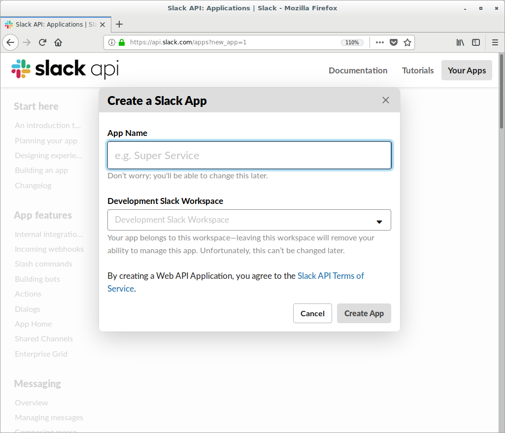

### Dodaj bot usera

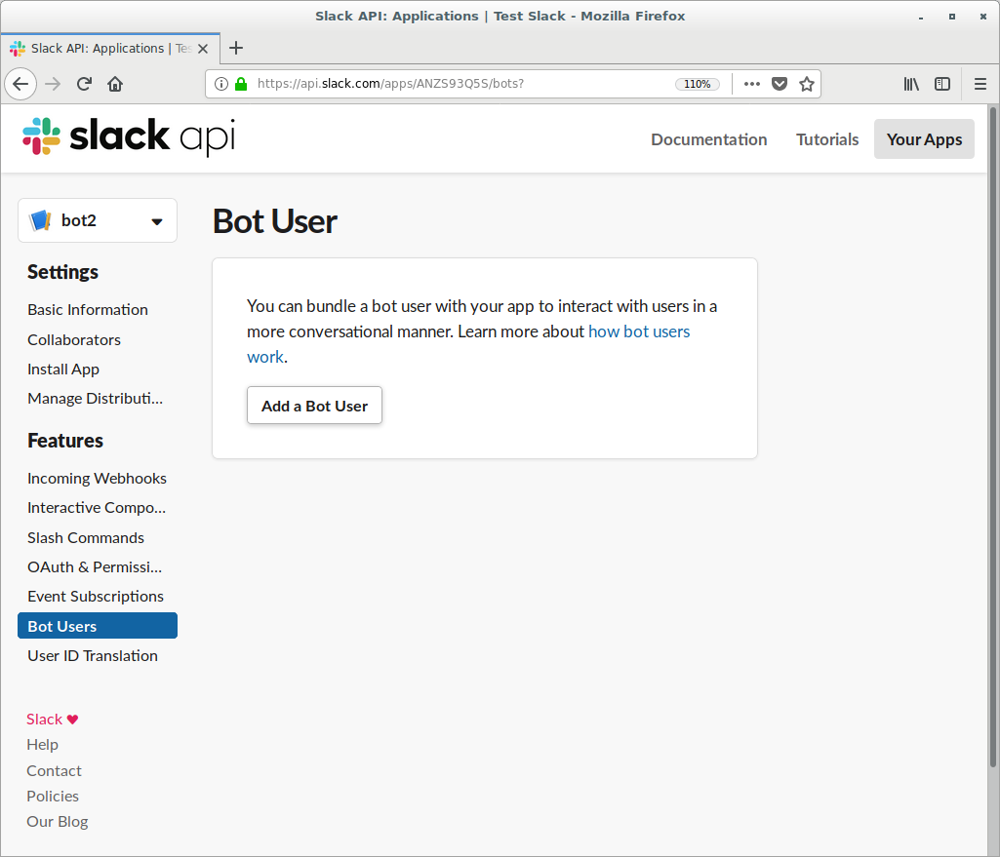

### Nazwania i zaproszenie bota

Następnie nazywamy naszego bota oraz dodajemy go na serwer

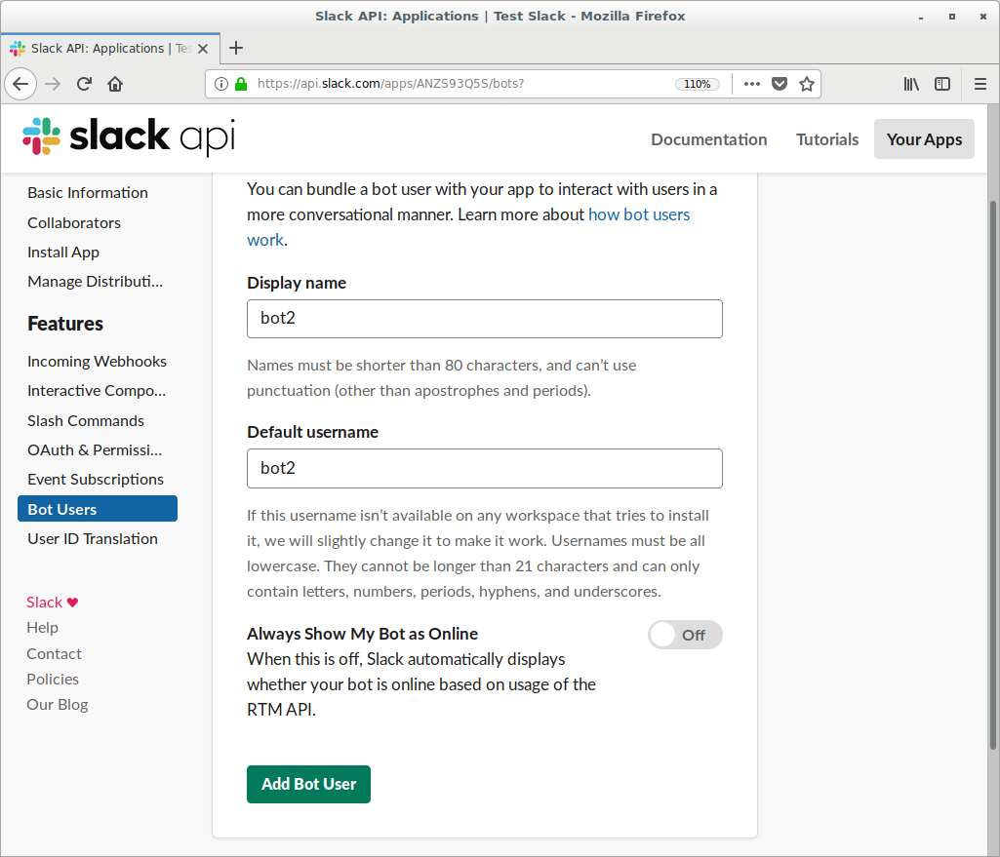

### Aktywacja funkcji bota

Następnie wchodzimy w zakładkę " Interactive Components " i przełanczamy z "off" na "on"

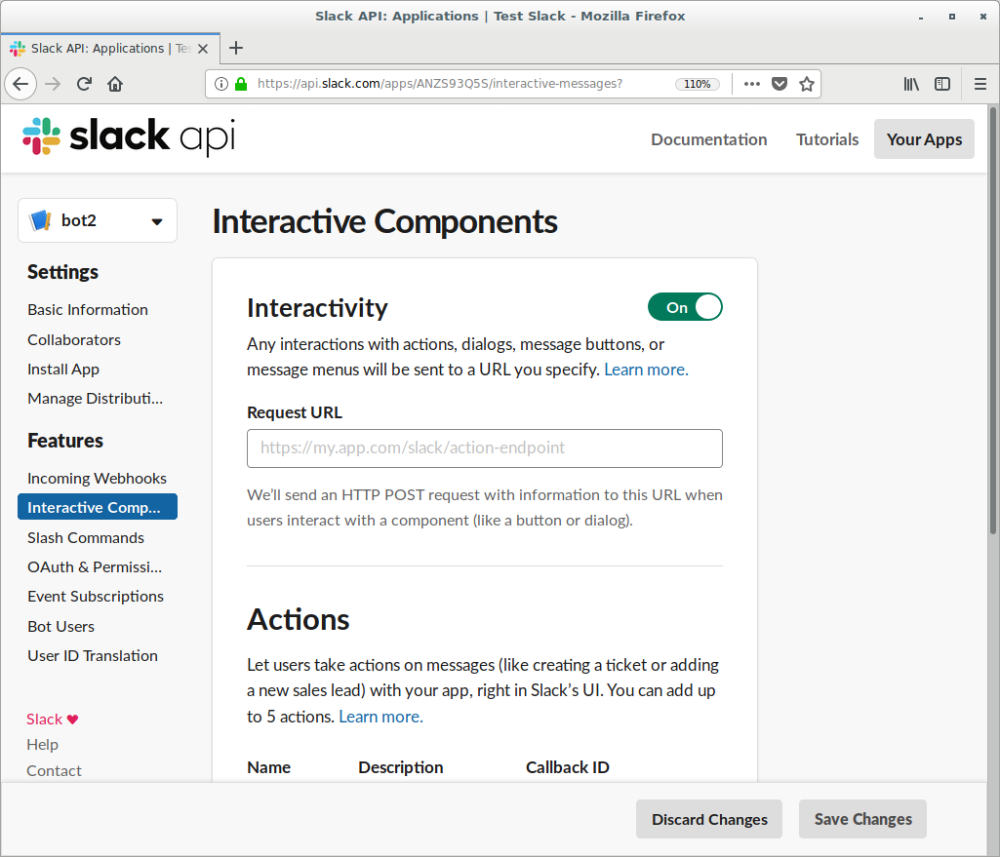

### Podpięcie bota do serwera http

Następnie podajemy "Request URL" np. https://Nasza_domena/slack/message_actions
I zapisujemy zmiany
Aby to wykonać należy włączyć skrypt bota

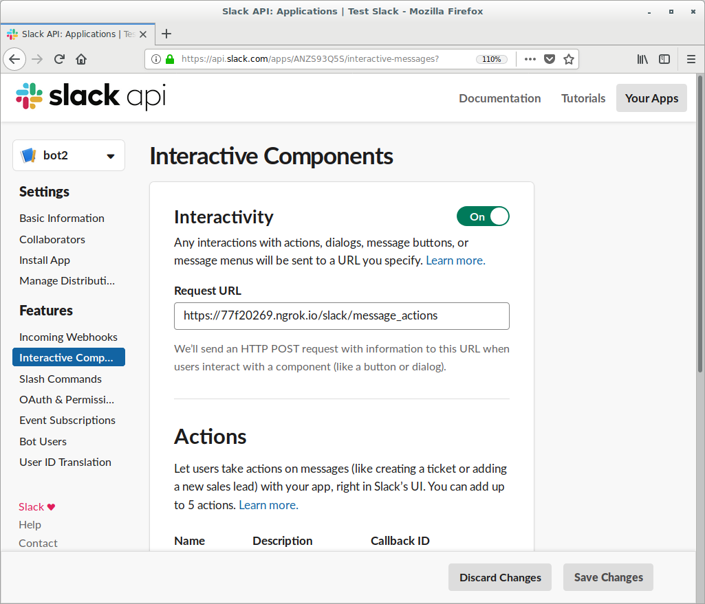

### Uprawnienia bota

W tym momencie w zakładce OAuth w sekcji "scopes" nadajemy mu permise 'admin' i klikamy "save changes"

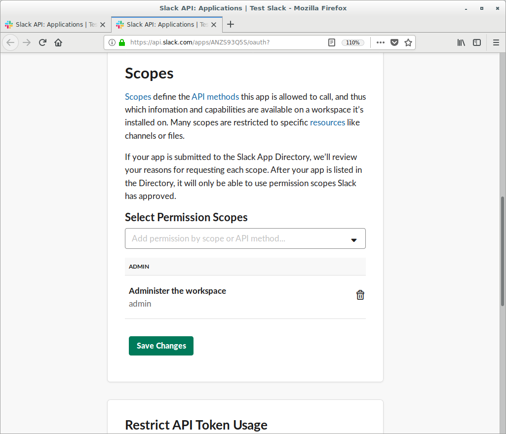

### Instalacja aplikacji na serwerze slacka

Natępnie instaluje go na swoim serwerze

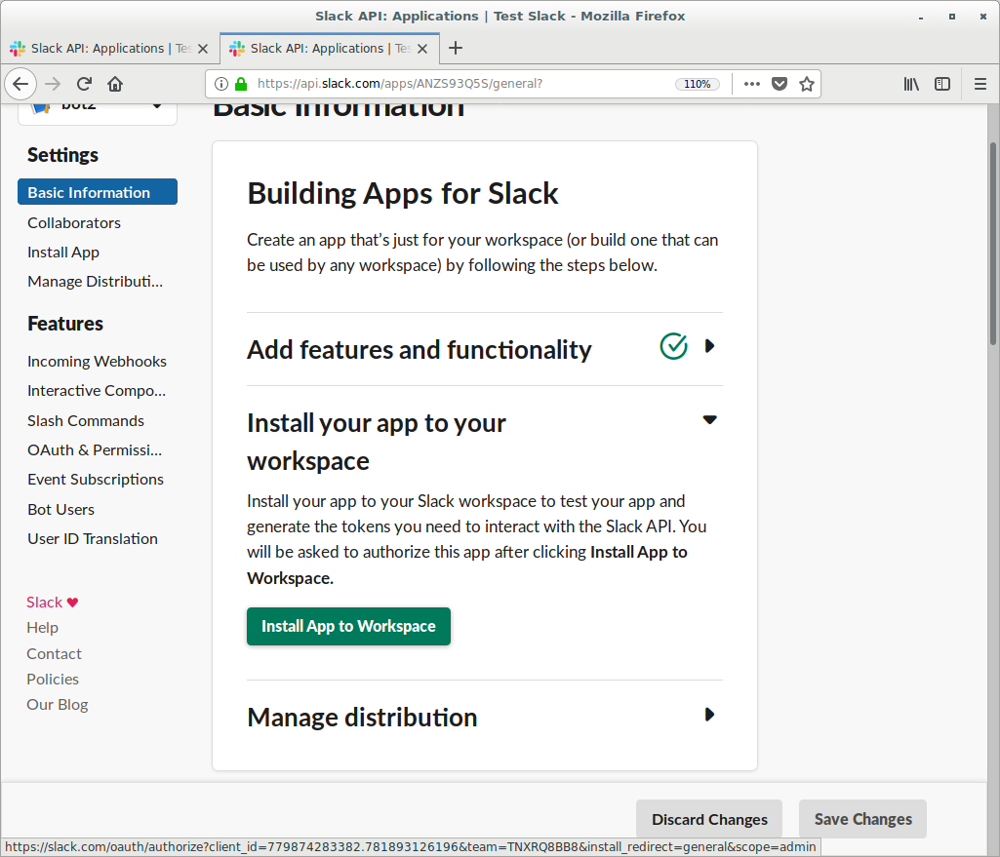

### Redirect URL

Potem w zakładce  "OAuth Tokens & Redirect URLs" dodajemy redirect URLs np. https://example.com/path
Jest to strona która pojawi się gdy zainstalujemy bota.

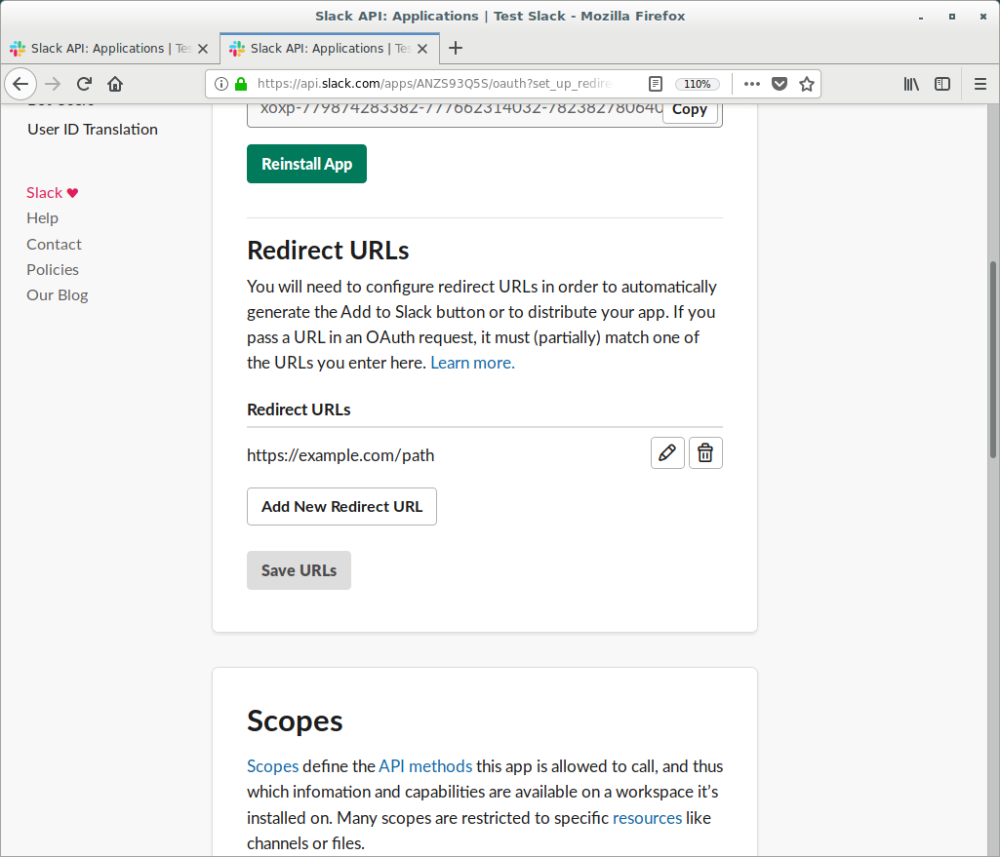

### Publikowanie bota

Następnie w "Manage Distribution" zaznaczamy "I’ve reviewed and removed any hard-coded information" i publikujemy bota:
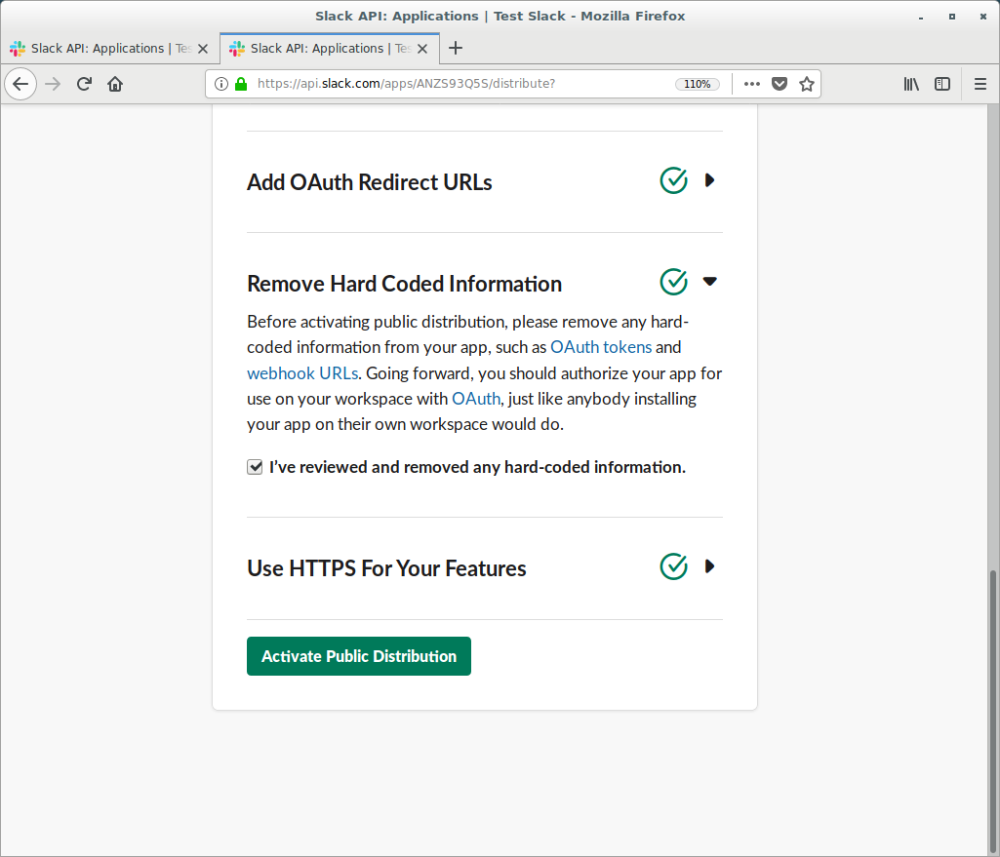

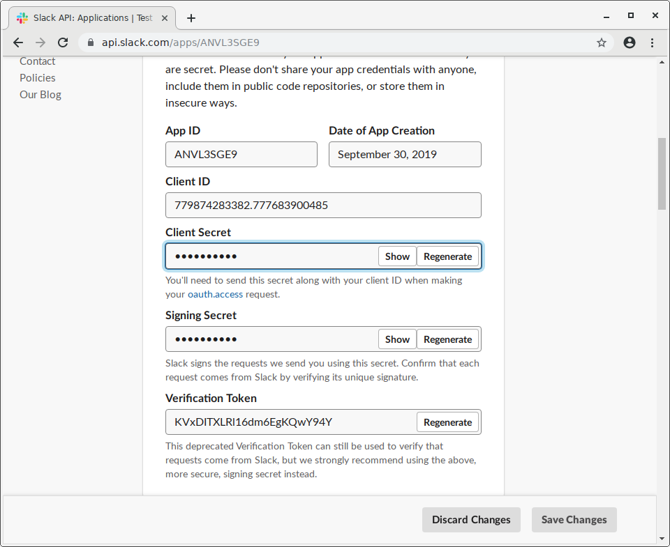

To po kliknięciu "show", pojawi się nasz signing secret

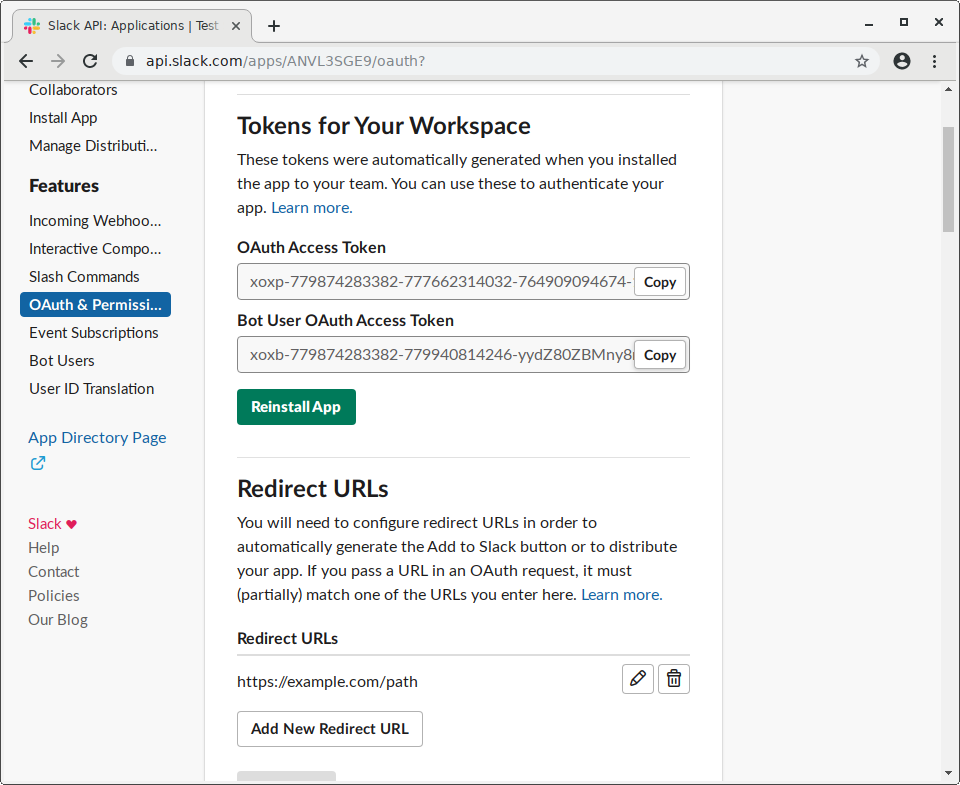

Nasz token to pojawia się po dodaniu bot usera, zaczyna się od "xoxb-" , można łatwo go skopiować klikając kopiuj


Następnie w zakładce 'Event Subscriptions' włączamy eventy i podajemy następujący ades "https://Nasz_domena/slack/events

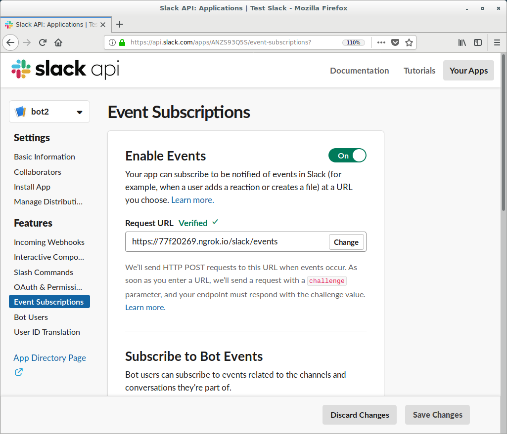

Aby to zadziałało trzeba mieć uruchiomony skrypt bota
Po właczeniu eventów należy dodać:
w "Subscribe to Bot Event" oraz "Subscribe to Workspace Events" nastepujące eventy

 * message.im
 * message.channels
 * group_history_changed

Dodatkowo należy nadać mu uprawnienia admina oraz message.channels , poniżej załączam ofcjialną dokumnetacja aplikacji na slacku:
[sack bot tut](https://github.com/slackapi/python-slackclient/tree/master/tutorial)