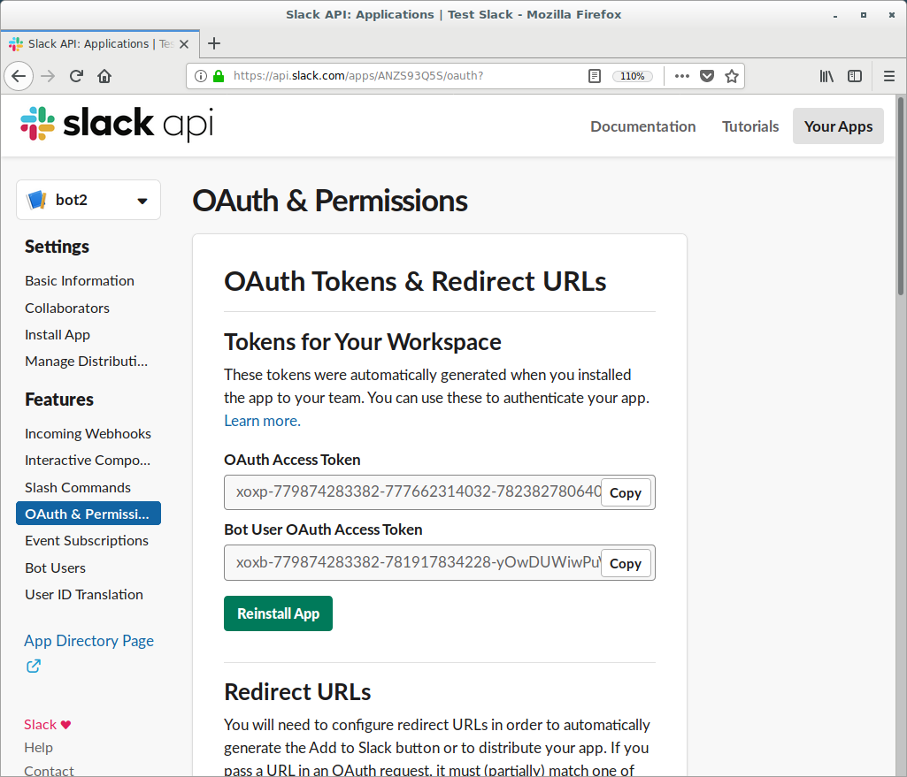
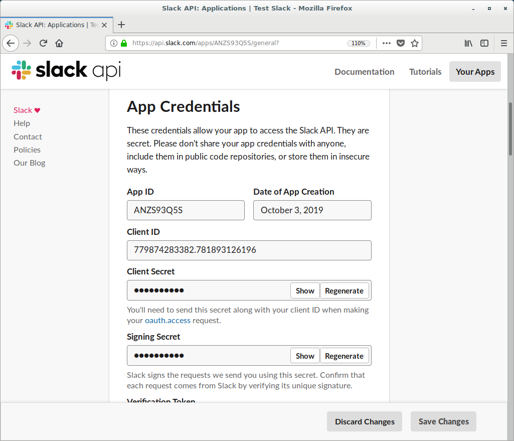

## Zakładasz nową aplikację

Klik na url: [slack new_app](https://api.slack.com/apps?new_app=1)

Dodaj bot usera

Następnie nazywamy naszego bota oraz dodajemy go na serwer

Następnie wchodzimy w zakładkę " Interactive Components " i przełanczamy z "off" na "on"

Następnie podajemy "Request URL" np. https://<Nasza domena>/slack/message_actions
I zapisujemy zmiany

W tym momencie w zakładce OAuth w sekcji scopes nadajemy mu perrmise 'admin' i klikamy "save changes"

Natępnie instaluje go na swoim serwerze

Potem w zakładce  "OAuth Tokens & Redirect URLs" dodajemy redirect URLs np. https://example.com/path

Następnie w "Manage Distribution" zaznaczamy "I’ve reviewed and removed any hard-coded informatio" i publikujemy bota!!!

Teraz jeszcze raz dodajemy bnot usera a nstępnie w kodzie podmieniamy następujące linikjki:

To jest nasz token "Bot User OAuth Access Token"

A to jest nasz klucz "Signing Secret"

slack_event_listen = SlackEventAdapter(signing_secret='Nasz klucz', endpoint="/slack/events", server=app)
token = 'Nasz token'

Teraz muszimy przypisać w kodzie te dwie wartości

Następnie uruchamiamy kod bota "python event.py" albo "./event.py"

Następnie w zakładce Event Subscriptions włączamy eventy i podajemy następujący adess "https://<Nasz domena>/slack/events

Dodatkowo można nadać mu uprawnienia admina, poniżej załączam ofcjialną dokumnetacja aplikacji na slacku
[sack tut](https://github.com/slackapi/python-slackclient/tree/master/tutorial)