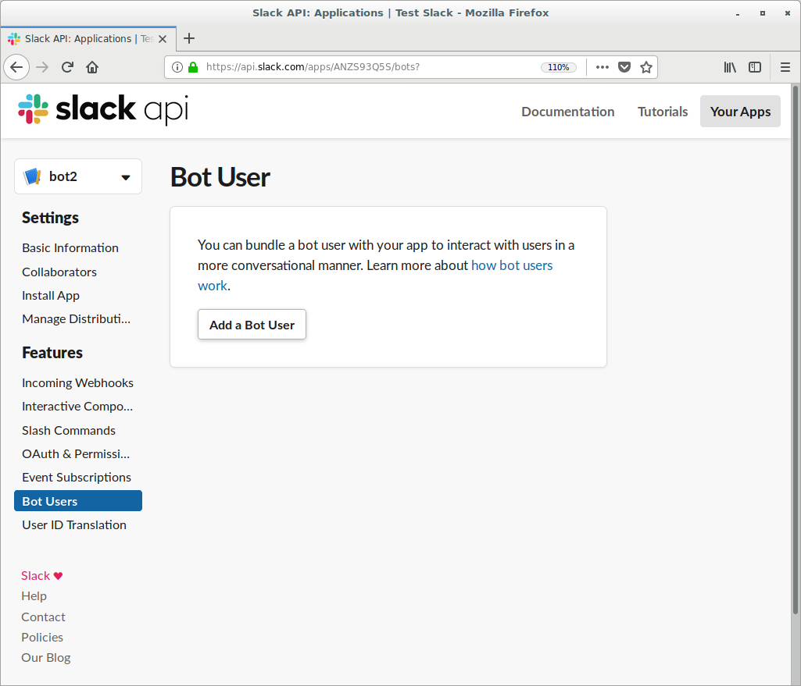
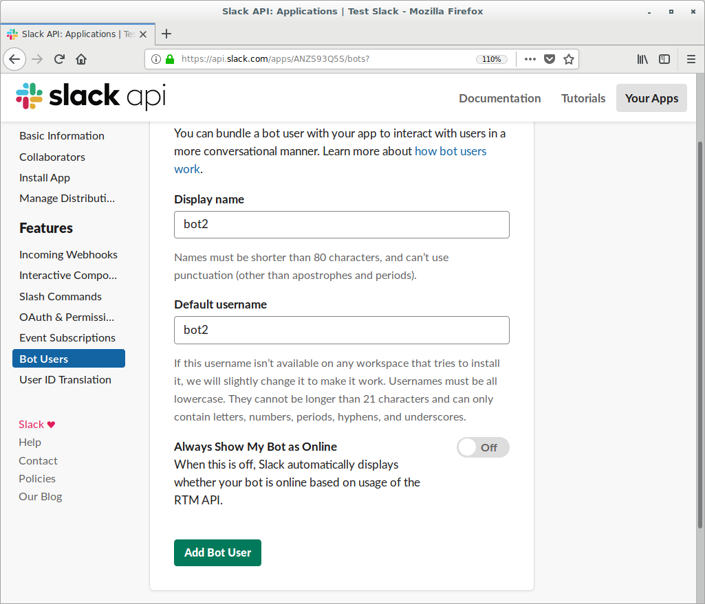
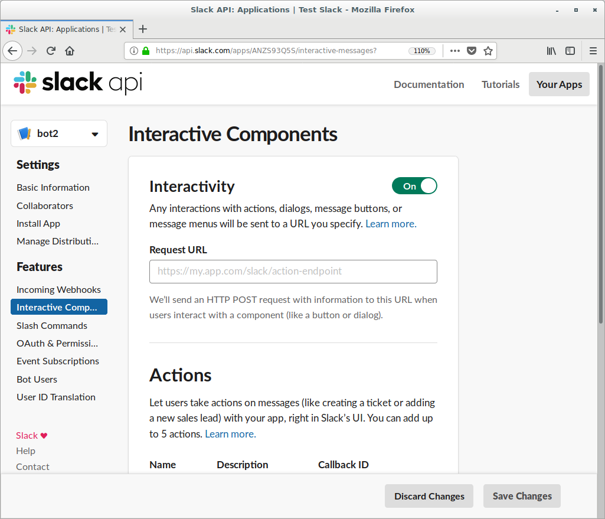
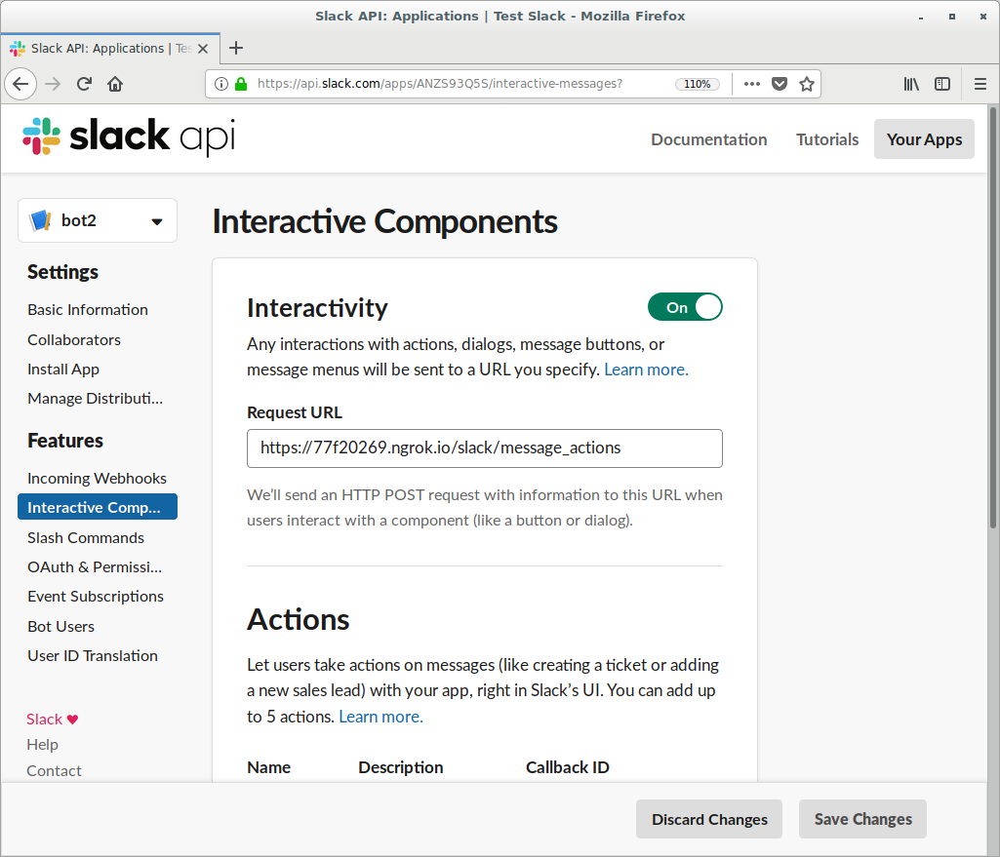
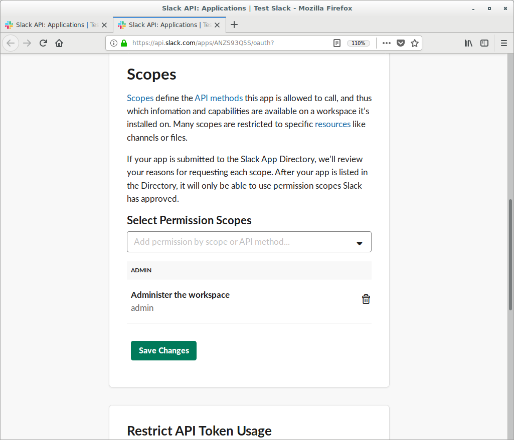
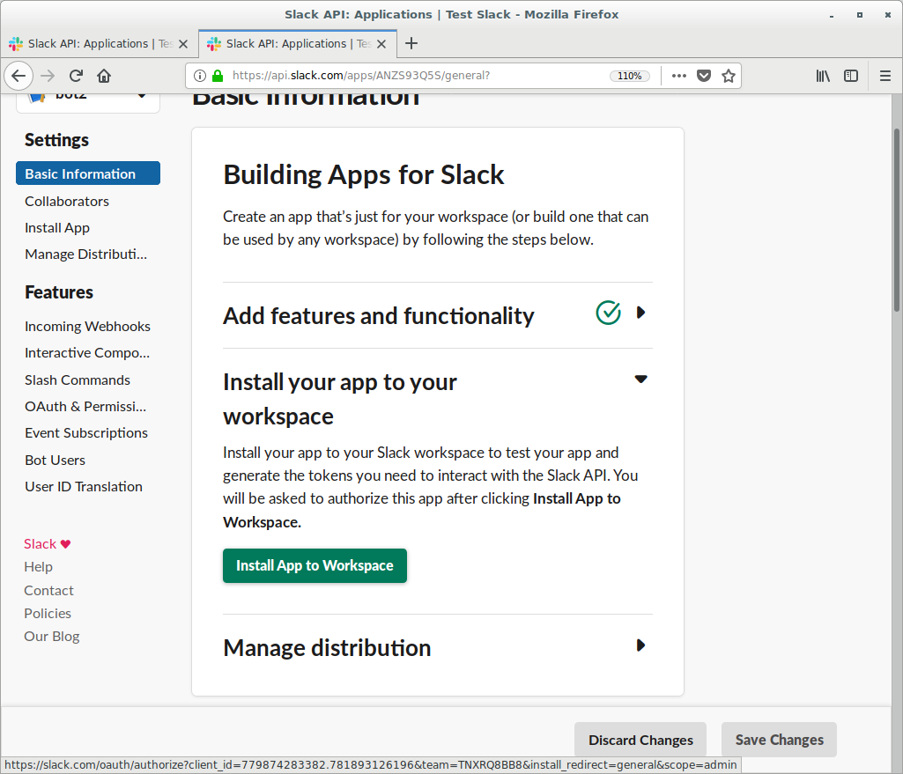
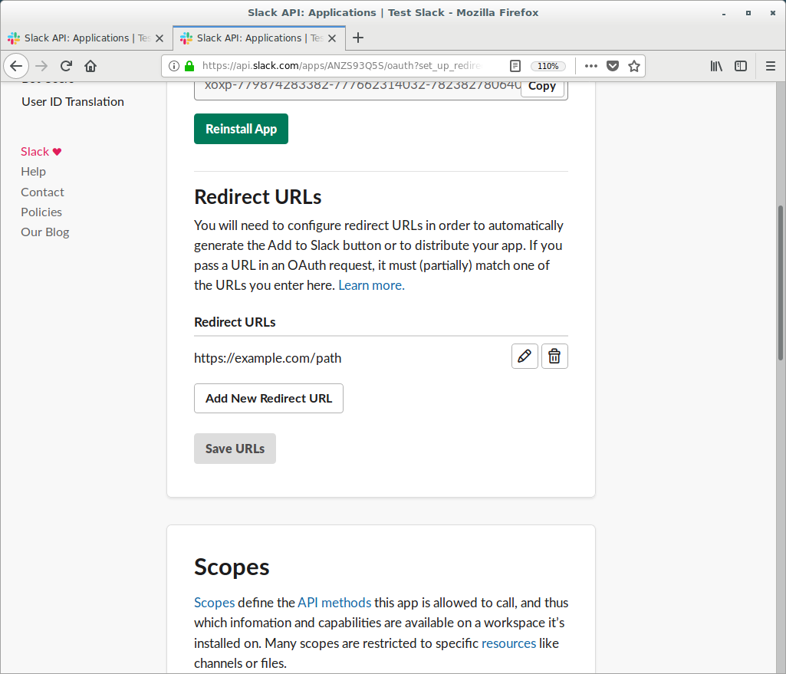
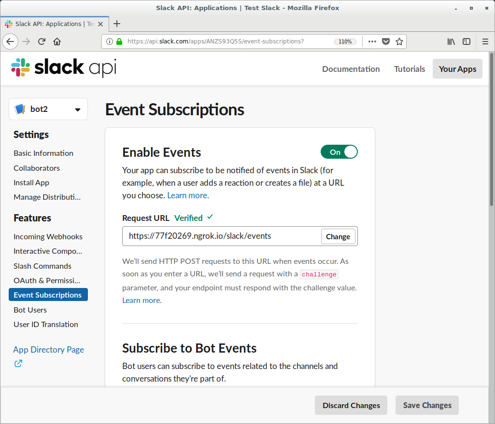

# Konfiguracja slack bota

### Zakładasz nową aplikację

Klik na url: [slack new_app](https://api.slack.com/apps?new_app=1)


### Dodaj bot usera



### Nazwania i zaproszenie bota

Następnie nazywamy naszego bota oraz dodajemy go na serwer



### Aktywacja funkcji bota

Następnie wchodzimy w zakładkę " Interactive Components " i przełanczamy z "off" na "on"



### Podpięcie bota do serwera http

Następnie podajemy "Request URL" np. https://<Nasza domena>/slack/message_actions
I zapisujemy zmiany



### Uprawnienia bota

W tym momencie w zakładce OAuth w sekcji "scopes" nadajemy mu permise 'admin' i klikamy "save changes"



### Instalacja aplikacji na serwerze slacka

Natępnie instaluje go na swoim serwerze



### Redirect URL

Potem w zakładce  "OAuth Tokens & Redirect URLs" dodajemy redirect URLs np. https://example.com/path



### Publikowanie bota

Następnie w "Manage Distribution" zaznaczamy "I’ve reviewed and removed any hard-coded information" i publikujemy bota:


Teraz zmieniamy:

### Token


To jest nasz token "Bot User OAuth Access Token"

### Klucz

A to jest nasz klucz "Signing Secret":


```
slack_event_listen = SlackEventAdapter(signing_secret='Nasz klucz', endpoint="/slack/events", server=app)
token = 'Nasz token'
```


Teraz muszimy przypisać w kodzie te dwie wartości

Następnie uruchamiamy kod bota "python event.py" albo "./event.py"

Następnie w zakładce 'Event Subscriptions' włączamy eventy i podajemy następujący ades "https://<Nasz domena>/slack/events



Dodatkowo można nadać mu uprawnienia admina, poniżej załączam ofcjialną dokumnetacja aplikacji na slacku:
[sack bot tut](https://github.com/slackapi/python-slackclient/tree/master/tutorial)